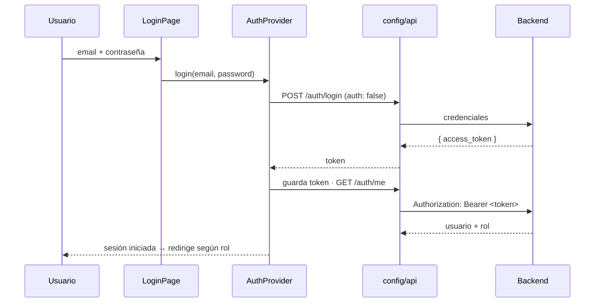

# Arquitectura del Frontend — Diagnóstico

> Cómo está construido el frontend, qué patrones usa y por qué. Complemento del
> [`COMPONENTES.md`](COMPONENTES.md) (mapa de componentes) y del `README.md` (stack y puesta en marcha).

---

## 1. Objetivo y decisiones de stack

SPA para el personal del centro (administración, recepción, médicos) que consume la API REST del backend (FastAPI) por HTTP/JSON con autenticación **JWT**.

| Decisión | Por qué |
|----------|---------|
| **React 19 + Vite** | SPA rápida, HMR en desarrollo, build estático simple de desplegar |
| **JavaScript (sin TypeScript)** | MVP con deadline corto → menos fricción; el dominio es pequeño y estable |
| **React Router 7** | enrutado declarativo + guardas por rol |
| **Tailwind CSS v4** | estilos utilitarios + tema de marca centralizado (`@theme`) |
| **Context API (no Redux)** | el único estado global es la sesión → Context es suficiente, sin librerías extra |
| **`fetch` nativo (no axios)** | una capa fina propia cubre las necesidades; una dependencia menos |
| **pnpm · Oxlint** | instalación reproducible y linting rápido |

> **Principio rector:** el código lo más simple posible. Nada de abstracciones prematuras.

---

## 2. Estructura y Atomic Design

```
src/
  config/       # capa de acceso a datos (configClient + api) — configuración por entorno
  auth/         # sesión: AuthContext · AuthProvider · useAuth · ProtectedRoute
  components/
    atoms/      # piezas básicas sin lógica de negocio (Button, Input, Card…)
    molecules/  # combinaciones reutilizables (Field, Table, AppointmentFields…)
    organisms/  # secciones con estado/lógica (Sidebar, AppointmentDetail, forms)
  layouts/      # AuthLayout · AppLayout
  pages/        # una por ruta
  utils/        # helpers puros (date, text, data) + metadata (APPOINTMENT_STATES, ROLES)
  router.jsx    # definición de rutas + guardas por rol
  App.jsx       # monta el router
  main.jsx      # providers (Router + Auth)
```

Detalle de cada carpeta y componente en [`COMPONENTES.md`](COMPONENTES.md).

---

## 3. Principios y patrones de diseño

| Patrón / principio | Dónde vive | Qué resuelve |
|--------------------|-----------|--------------|
| **Atomic Design** | `components/atoms · molecules · organisms` | organización por complejidad; jerarquía de composición clara |
| **Presentacional vs. contenedor** | átomos/moléculas (presentacionales) vs. páginas/organismos (con estado) | separar "cómo se ve" de "qué hace" |
| **Composición y reutilización** | `Table`, `AppointmentFields`, `DataRow` | una pieza configurable sirve a varias vistas (Pacientes/Usuarios/Médicos comparten `Table`) |
| **Single source of truth** | `utils/citas.js` (`APPOINTMENT_STATES`), `utils/roles.js` (`ROLES`) | la metadata de estados/roles se define **una vez** y se consume en todas partes |
| **Provider (Context API)** | `auth/AuthContext` + `AuthProvider` | expone la sesión (usuario, rol, login/logout) a todo el árbol sin *prop drilling* |
| **Custom Hook** | `auth/useAuth` | encapsula el consumo del contexto → `const { user } = useAuth()` |
| **Route Guard** | `auth/ProtectedRoute` | protege rutas por sesión y por rol (redirige a login si no procede) |
| **Fachada / adaptador sobre `fetch`** | `config/configClient` (`request`) + `config/api` (`get/post/put/del`) | un único punto para cabeceras, token, errores y base URL |
| **Manejo global de errores** | `request` + handler de 401 | un 401 (token caducado) cierra sesión y redirige **desde un solo sitio** |
| **Configuración por entorno** | `VITE_API_URL` (`.env`) | sin URLs *hardcodeadas*; el `.env` está en `.gitignore` |

### Idioma del código
- **Inglés:** todo lo técnico y propio (componentes, props, funciones, utils, capa de red).
- **Español (a propósito):** vocabulario de **dominio** (`medicos`, `pacientes`, `citas`…) y **campos de la API** (`nombre_completo`, `medico_id`…), para **alinearse con el backend**.

---

## 4. Flujo de datos y autenticación (JWT)

La sesión se basa en un **token JWT** guardado en `localStorage` y enviado como *bearer token* en cada petición.



**Expiración / 401 global:** cualquier respuesta `401` en una petición autenticada dispara, desde `configClient`, un *handler* registrado por `AuthProvider` que **borra el token, limpia la sesión y redirige a `/login`** — sin repetir esa lógica en cada página.

**Guardas por rol:** `ProtectedRoute` envuelve las rutas. `RECEPCION` no ve `/usuarios` ni `/config`; `MEDICO` accede a Panel y su Agenda en **solo lectura**.

---

## 5. Programación asíncrona

Toda la comunicación con el backend es **asíncrona** con `async/await`:

- **Capa de red** (`config/api`): cada método (`get`, `post`, `put`, `del`) devuelve una `Promise`; el consumidor hace `await`.
- **Cargas en paralelo:** cuando una vista necesita varios recursos a la vez, se usa `Promise.all` para no encadenar esperas innecesarias.
  ```js
  const [medicos, servicios] = await Promise.all([
    api.get('/medicos'),
    api.get('/servicios'),
  ])
  ```
- **Manejo de errores:** cada llamada va en `try/catch`; los errores de negocio del backend llegan como `ApiError` (con `status`, `message` y `detail`) y se muestran al usuario.
- **Estados de carga:** cada vista mantiene `loading` / `error` para reflejar el estado de la petición en la UI (`Spinner`, `Alert`).

---

## 6. Integración con el backend (contrato)

Puntos del contrato que el frontend respeta:

- **Fechas en hora local *naive*** (sin sufijo `Z`): las citas se envían como `YYYY-MM-DDTHH:MM:00`.
- **IDs UUID** (strings en JSON).
- **Reglas de negocio en el backend** (el front solo las consume): *upsert* de paciente por nombre+edad, cero solapamientos por médico, disponibilidad con sobrecupo, horas en `:00/:15/:30/:45`.
- **Servicios por especialidad:** al elegir médico en el formulario de cita, el selector de servicios se **filtra a las especialidades de ese médico** (cruzando `especialidades` de médico y servicio, relación N:M) — evita agendar servicios que no corresponden. El backend también ofrece `GET /servicios?medico_id=` para el mismo filtro en servidor.
- **Bajas lógicas:** `DELETE /pacientes/{id}` y `DELETE /usuarios/{id}` desactivan sin borrado físico.

---

## 7. Testing

**Estado actual:** el MVP se ha validado **manualmente** contra el backend real (login, CRUD de pacientes, alta/edición/cancelación de citas, catálogos) en cada vista.

**Plan de testing propuesto** (siguiente iteración, con **Vitest + React Testing Library**):

| Nivel | Qué probar |
|-------|-----------|
| **Unitario (utils)** | `date.js` (formateos, *off-by-one*), `data.js` (`indexBy`), `text.js` (`initials`) — funciones puras, fáciles de cubrir |
| **Componente** | `Table` (estados carga/error/vacío/filas), `AppointmentFields` (validación de hora `:00/:15/:30/:45`), `ProtectedRoute` (acceso por rol) |
| **Integración** | flujo de login (token → sesión), manejo de 401 global, envío de nueva cita con *mock* de la API |

---

## 8. Mejoras y próximos pasos

- **Delete** de pacientes/usuarios desde la tabla (baja lógica) — *listo para implementar*.
- **Historia clínica / notas** (fase 2): la API ya contempla notas clínicas; falta la UI.
- **Tests automatizados** (ver §7).
- **Vista semanal** de agenda (hoy solo vista Día).
- **Paginación / búsqueda en servidor** si crecen los listados.
- **Refresh token** para renovar sesión sin re-login.
