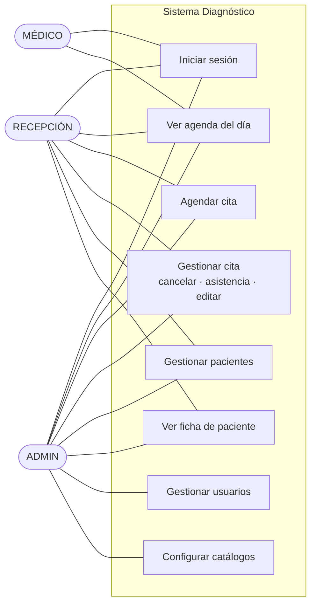

# Casos de uso — Diagnóstico

> Actores y flujos principales del ERP desde el frontend. Complementa a
> [`ARQUITECTURA.md`](ARQUITECTURA.md) y [`COMPONENTES.md`](COMPONENTES.md).

---

## Actores

| Actor | Descripción | Acceso |
|-------|-------------|--------|
| **ADMIN** | Administración del centro | Todo: pacientes, agenda, citas, **usuarios** y **configuración** |
| **RECEPCIÓN** | Personal de recepción | Pacientes, agenda, citas (sin usuarios ni configuración) |
| **MÉDICO** | Personal médico | Panel y **su propia agenda** en **solo lectura** |

Todos los actores son **personal interno** que inicia sesión con email y contraseña. No hay acceso de pacientes.

---

## Diagrama de casos de uso

---

## Casos de uso detallados

### CU-01 · Iniciar sesión
- **Actor:** todos.
- **Precondición:** el usuario tiene credenciales activas.
- **Flujo:** introduce email y contraseña → el sistema valida contra `POST /auth/login` → guarda el JWT → carga el perfil (`GET /auth/me`) → redirige según rol.
- **Postcondición:** sesión iniciada; la navegación se adapta al rol.
- **Alternativos:** credenciales inválidas → mensaje de error; token caducado en cualquier momento → cierre de sesión automático (401 global).

### CU-02 · Ver agenda del día
- **Actor:** todos (MÉDICO solo la suya).
- **Flujo:** abre `/agenda` → el sistema pide citas del día, médicos, servicios y disponibilidad → pinta la rejilla médico × hora, grisando las horas fuera del horario de cada médico.
- **Postcondición:** el usuario ve la ocupación del día y puede abrir el detalle de una cita.

### CU-03 · Agendar cita
- **Actor:** ADMIN, RECEPCIÓN.
- **Precondición:** existen médicos y servicios.
- **Flujo:** abre "Nueva cita" → introduce paciente (nombre + edad), médico, servicio, fecha, hora y duración → el backend hace *upsert* del paciente y valida disponibilidad y solapamientos → confirma.
- **Postcondición:** la cita queda agendada y aparece en la agenda.
- **Alternativos:** solapamiento o fuera de disponibilidad → el backend responde con error; recepción puede **forzar sobrecupo**.

### CU-04 · Gestionar una cita
- **Actor:** ADMIN, RECEPCIÓN.
- **Flujo:** desde la agenda o el panel, abre el detalle de la cita → puede **cancelar** (libera el cupo), **marcar asistencia** (atendida / no asistió) o **editar/mover** (revalida reglas).
- **Postcondición:** el estado de la cita se actualiza.

### CU-05 · Gestionar pacientes
- **Actor:** ADMIN, RECEPCIÓN.
- **Flujo:** en `/pacientes` busca por nombre o cédula, da de alta un paciente nuevo, o abre su ficha para editar/consultar.
- **Postcondición:** el listado refleja los cambios.

### CU-06 · Ver ficha de paciente
- **Actor:** ADMIN, RECEPCIÓN.
- **Flujo:** abre `/pacientes/:id` → ve datos personales e **historial de citas** en pestañas.

### CU-07 · Gestionar usuarios (personal)
- **Actor:** **solo ADMIN**.
- **Flujo:** en `/usuarios` crea/edita personal (nombre, email, rol; matrícula y especialidades si es médico), o **activa/desactiva** (baja lógica).
- **Postcondición:** el acceso del personal queda configurado.

### CU-08 · Configurar catálogos
- **Actor:** **solo ADMIN**.
- **Flujo:** en `/config` añade **especialidades** y **servicios** (con categoría).
- **Postcondición:** los catálogos quedan disponibles para agendar.

---

## Trazabilidad con las vistas

| Caso de uso | Ruta | Página |
|-------------|------|--------|
| CU-01 | `/login` | `LoginPage` |
| CU-02 | `/agenda` · `/` | `AgendaPage` · `PanelPage` |
| CU-03 | `/citas/nueva` | `NewAppointmentPage` |
| CU-04 | (modal) | `AppointmentDetail` |
| CU-05 | `/pacientes` | `PatientsPage` |
| CU-06 | `/pacientes/:id` | `PatientFilePage` |
| CU-07 | `/usuarios` | `UsersPage` |
| CU-08 | `/config` | `ConfigPage` |
